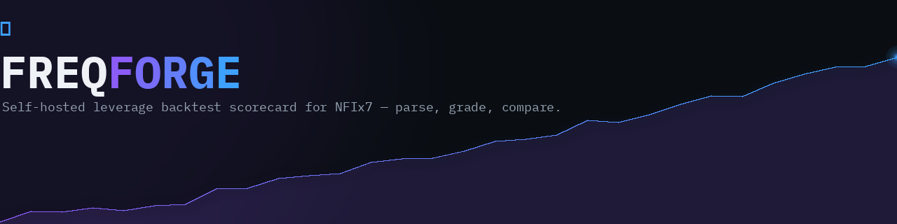
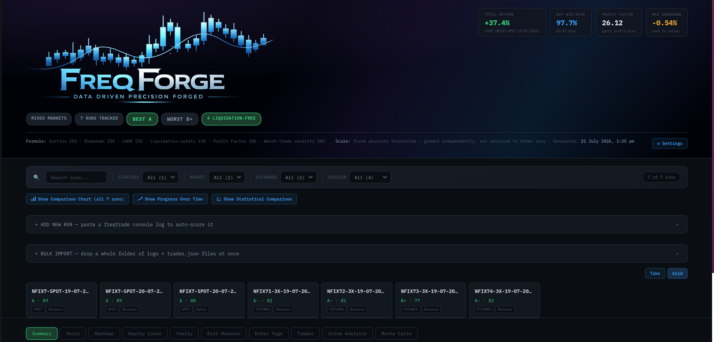
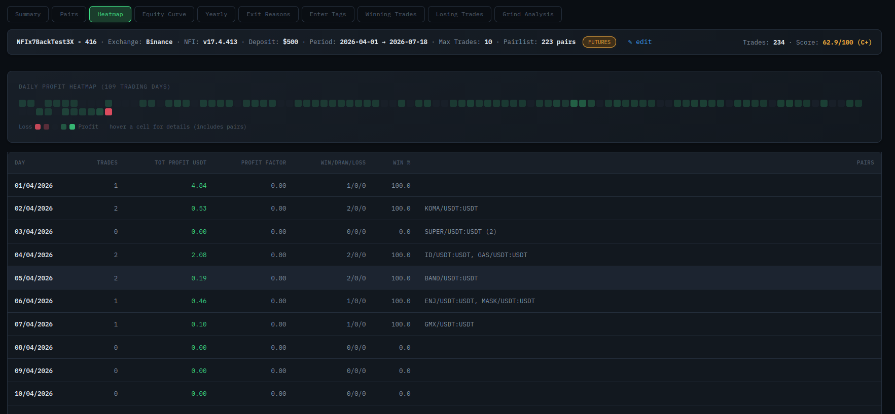
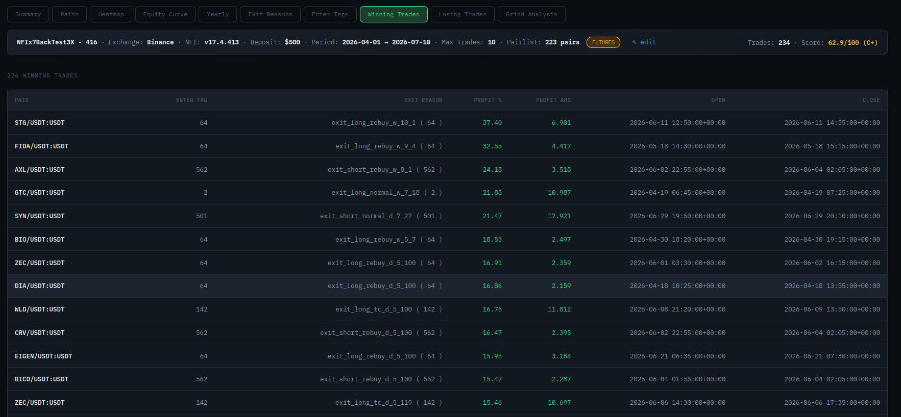
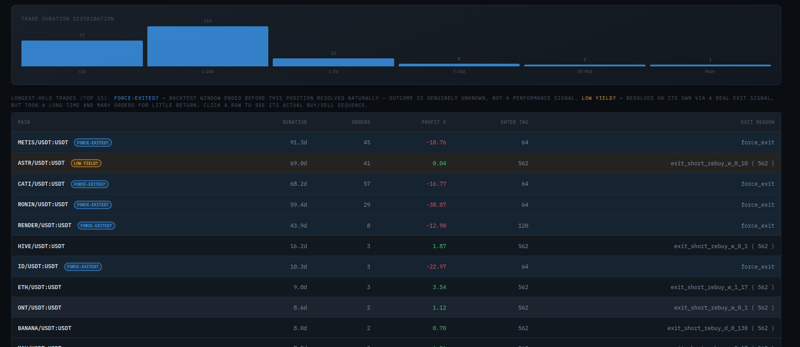
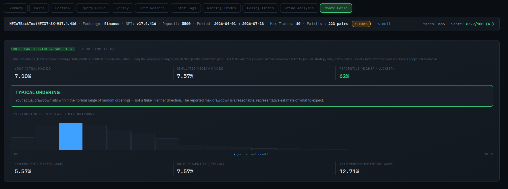
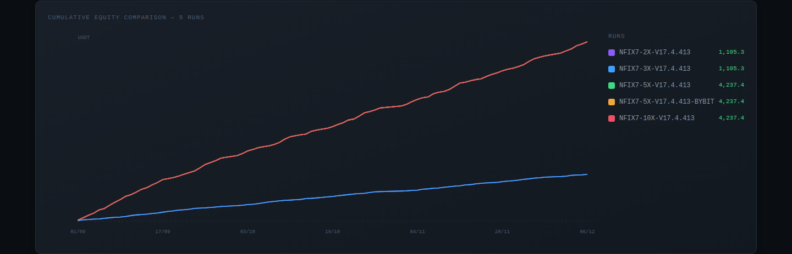
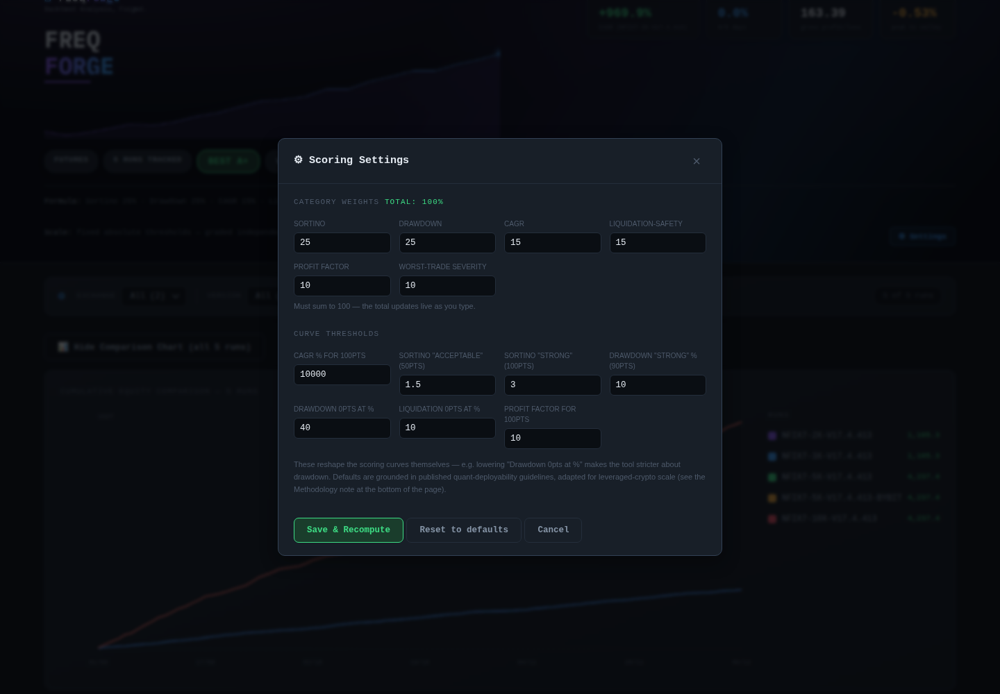

# FreqForge by Deano

Self-hosted leverage backtest scorecard for NFIx7. Real SQLite storage, served over
HTTP, accessible from any device on your network while the server's running. Every
score is computed **independently per run against fixed thresholds** — adding,
removing, or editing one run never changes another's grade. Weights and thresholds
are fully configurable in-app, not hardcoded.



## Project structure

```
freqforge/
├── app.py                    Flask backend, SQLite storage, scoring config API
├── static/
│   ├── index.html            HTML skeleton only — no embedded CSS/JS
│   ├── css/app.css           All styling
│   ├── img/banner.png        In-app header banner (swap freely, keep the filename)
│   └── js/
│       ├── constants.js      Grade colors, letter-grade bands, core state (RUNS/DATA/ORDER)
│       ├── api.js            fetch wrappers + HTML/JS escaping utilities
│       ├── config.js         Scoring config: defaults, fetch/save against /api/config
│       ├── scoring.js        The actual scoring curves + recompute()
│       ├── hero.js           Top banner: stat cards, badges, dynamic formula/methodology text
│       ├── filters.js        Exchange/Version filter bar
│       ├── parsers.js        Console-log and trades.json parsers
│       ├── addrun.js         "+ Add New Run" panel, auto-assigned Strategy labels
│       ├── bulkimport.js     "+ Bulk Import" — multi-file drop, log/trades pairing
│       ├── summary.js        Run banner, grade dial, Quick Edit (rename/exchange/grind slots)
│       ├── settings.js       ⚙ Settings modal for scoring weights/thresholds
│       ├── nav.js            Run selection, subtab-preserving navigation
│       ├── tabs.js           Every detail tab: Pairs, Heatmap, Grind Analysis, etc.
│       ├── compare.js        Multi-run cumulative-equity comparison chart
│       └── app.js            init(), backup export/import
├── docs/images/               Screenshots + banner used in this README
├── nfi-integration/
│   ├── NFIx7BackTest.py       Ready-to-use strategy file — see "NFI version tracking"
│   └── backtest-runner-service.yml.example
│                              Reference only — goes in your freqtrade project's
│                              compose file, NOT FreqForge's (see file header)
├── test/
│   └── parser-tests.js        Regression tests for the log/trades parser
├── requirements.txt
├── Dockerfile
└── docker-compose.yml
```

Plain `<script src="...">` tags, loaded in dependency order — no build step, no
bundler. Everything shares one global scope; the split is purely for readability and
navigation, not a different runtime model.

## Run it

### Option A: Docker (matches your existing NFI stack)

```bash
cd freqforge
docker compose up -d --build
```

Open `http://<your-machine-ip>:5055` from any device on your LAN.

Data lives in `./data/leverage_runs.db` on the host (bind-mounted), so it survives
container rebuilds/recreates same as your other services. Scoring config lives
alongside it in `./data/scoring_config.json`.

> **Upgrading from an older `nfix7-scorecard` deployment?** The Docker service name
> changed from `nfix7-scorecard` to `freqforge` as part of this rebrand. Run
> `docker compose down` against your **old** compose file first, then drop this
> update into the same project folder (so your existing `./data/` carries over
> automatically) before running `docker compose up -d --build` again — otherwise
> you'll end up with two containers instead of one replacing the other.

### Option B: Plain Python, no Docker

```bash
cd freqforge
pip install -r requirements.txt
python app.py
```

Open `http://localhost:5055`.

---

## Adding a run

Click **"+ ADD NEW RUN"** to expand the panel. Two files matter per run — only the
first is required, the second unlocks several extra detail tabs.

### Step 1 — run the backtest

```bash
# 5x
docker compose run --rm freqtrade_backtest_binance backtesting \
  --config user_data/config_back_test.json \
  --strategy NFIx7BackTest5x \
  --timerange 20250912-20260712 --timeframe 5m \
  --export trades --breakdown day \
  --backtest-filename user_data/backtest_results/leverage_test/baseline_5x \
  2>&1 | tee user_data/backtest_results/leverage_test/baseline_5x_console.log
```

This one command produces **two separate files you need**, in two different places:

| File | Where it lands | What it's for |
|---|---|---|
| `baseline_5x_console.log` | Exactly where you told it to (`leverage_test/`) — this is just your terminal's `tee` output | Load as the **console log** |
| `backtest-result-<timestamp>.zip` | `user_data/backtest_results/` (the parent folder, **not** `leverage_test/`) — freqtrade ignores `--backtest-filename` for this one and auto-names it | Extract → gives you the **trades JSON** |

### Step 2 — load the console log (required)

Paste its contents into the text box, or use the file picker.

### Step 3 — find and extract the trades JSON (optional, unlocks more tabs)

```bash
cd user_data/backtest_results
ls *.zip
```

To identify which zip is which, peek inside — the strategy filename gives it away:

```bash
unzip -l backtest-result-2026-07-12_20-52-42.zip
# look for something like: backtest-result-2026-07-12_20-52-42_NFIx7BackTest5x.py
```

Extract it, then load the **un-suffixed** `.json` file (not `_config.json`,
`_NFIx7BackTestNx.py`, or either `.feather` file):

```bash
mkdir -p extracted/5x
unzip -o backtest-result-2026-07-12_20-52-42.zip -d extracted/5x
```

### Step 4 — Strategy label auto-assigns itself, then save

Leave the **Strategy** field empty and click **Parse log** — it reads the leverage
straight from freqtrade's `"Using resolved strategy NFIx7BackTest5x"` line and combines
it with the date the backtest actually ran (parsed from the log's own timestamps —
not whenever you happen to upload it), producing something like
`NFIx7-5x-20-07-2026` automatically. Typing anything yourself is always respected and
never overwritten.

The label only needs to be unique and easy to scan now — exchange, NFI version, and
market type all live in their own searchable/filterable fields, so the label doesn't
need to carry them anymore. Saving a second run at the same leverage on the same day
won't silently overwrite the first; it gets a `-2` suffix instead.

Fix anything with an amber border in the review panel, then **Save this run**.
Repeat for each leverage level.

---

## The tabs

Once a run is saved, click its tile to see:

| Tab | Needs trades.json? | What it shows |
|---|---|---|
| **Summary** | No | Grade dial, score breakdown, risk instrument panel |
| **Pairs** | No | Per-pair performance (from the log's `BACKTESTING REPORT` table) |
| **Heatmap** | No\* | Daily profit calendar (from `DAY BREAKDOWN`) |
| **Equity Curve** | No | Cumulative profit chart for this one run |
| **Yearly** | No | Daily data aggregated by calendar year |
| **Exit Reasons** | No\* | Exit-reason breakdown (from `EXIT REASON STATS`) |
| **Enter Tags** | No\* | Entry-tag breakdown (from `ENTER TAG STATS`) |
| **Trades** | **Yes** | Every trade, with an All/Wins/Losses toggle — filters instantly, no re-fetch |
| **Grind Analysis** | **Yes** | Order-count/duration distributions, longest-held trades, click any trade for its full order sequence |
| **Monte Carlo** | **Yes** | Reshuffles your actual trades 1,000 times to test whether the reported max drawdown was luck of trade ordering or genuinely representative |

**\*** Heatmap, Exit Reasons, and Enter Tags work from the log alone, but freqtrade's
own tables are pair-agnostic. **If you've also loaded trades.json**, these three tabs
additionally show a **Pairs** column — which specific pairs contributed to each exit
reason, tag, or day.





### Grind Analysis — order-level detail and long/short handling

Click any trade in the "Longest-Held Trades" table for a popup showing its full
buy/sell order sequence — side, price, amount, cost, and timestamp per order.
**Correctly handles short trades**: freqtrade's raw order side (`buy`/`sell`) means
the *opposite* thing depending on trade direction — a short's entry is a `sell`, its
exit is a `buy`. Coloring by literal side alone would show every short's normal
opening as if something had gone wrong. Instead it's colored by actual open/close
semantics, with an explicit LONG/SHORT badge and Entry/Exit column so there's no
ambiguity either way.



---

## K-Ratio

Shown at the bottom of the Equity Curve tab. Measures whether a run's growth is a
smooth, statistically consistent trend or a noisy path that happens to end up
somewhere — two runs with identical final profit can score very differently here.
Computed via linear regression on log(equity) vs. day index; K-Ratio = slope ÷
standard error of the slope. Needs at least 5 days of Heatmap data loaded.

## Monte Carlo trade-reshuffling

A backtest's reported max drawdown reflects one specific ordering of trades — the
order they actually happened to occur in. This tab takes your actual trade sequence
and randomly reshuffles it 1,000 times, recomputing max drawdown for each reshuffle.
Total profit is identical in every simulation (same trades, same sum) — only the
*path* changes, which reveals whether your reported drawdown was a lucky, unlucky, or
typical ordering:



- **Favorable ordering** (top ~20% of simulations) — your actual drawdown was better
  than nearly all alternatives. Treat the reported number as optimistic; real-world
  risk is plausibly higher than this backtest suggests.
- **Unfavorable ordering** (bottom ~20%) — your actual drawdown was worse than nearly
  all alternatives. The tough sequence genuinely happened, but typical risk for this
  trade set looks better than what this one run reported.
- **Typical ordering** (middle ~60%) — the reported drawdown is a reasonable,
  representative estimate either way.

Needs trades.json loaded (uses each trade's `profit_abs` and `open_date`). Starting
equity for the simulation uses the run's recorded deposit, falling back to $500 if
none is set.

**CAGR is de-levered before scoring** — a 5x run's raw CAGR is divided by 5 before it
hits the scoring curve, so leverage-amplified returns aren't compared directly against
spot or lower-leverage runs on an unfair basis. This is the standard practice for
comparing differently-leveraged strategies (divide the leveraged return by its own
leverage to get an unlevered-equivalent figure), not something invented for this tool.
It's an approximation, not an exact conversion — volatility drag means realized
leveraged returns usually undershoot a clean N&times; multiple in practice — but it
removes the dominant distortion. The Score Breakdown panel shows the actual math for
any run where it applies (`4,015% raw ÷ 5x leverage = 803% de-levered`); spot runs are
always 1x and show no adjustment.

## Spot and futures support

Runs can be either market type — detected automatically from the log's Trading Mode
line where present, falling back to freqtrade's own pair-naming convention
(`BTC/USDT` = spot, `BTC/USDT:USDT` = futures) when it isn't, with a manual
Spot/Futures override always available via Quick Edit.

**Spot runs skip the Liquidation-safety scoring category entirely** — spot trading
has no leverage, so liquidation is structurally impossible, not just unlikely. That
category's weight redistributes proportionally across the other five rather than
scoring a risk that can't occur. The Score Breakdown panel shows the real
per-run weights this produces, and the Risk Instrument panel shows a plain
"not applicable" note instead of a misleading 0% gauge.

Badges reflect this too — the header shows "MIXED MARKETS" if you're tracking both,
and the "N LIQUIDATION-FREE" count only credits futures runs, since surviving zero
liquidation risk isn't a meaningful achievement for a run that was never exposed to it.

## Searching and filtering

Once you have 4+ runs, a search box appears above the run tiles — type any part of a
label to instantly narrow the list, useful once you're tracking enough
version/exchange/max-trades combinations that scrolling through tabs stops working.
Combines with the Market/Exchange/Version dropdown filters, which all narrow the same
visible set together.

## In-sample vs out-of-sample

Also in the Monte Carlo tab, below the reshuffling analysis. Splits your trades
chronologically — first 80% vs the most recent 20% — and compares total profit, win
rate, profit factor, and max drawdown across the split. Catches the common way
backtests overstate what to expect going forward: a strategy that looks great overall
only because of strong early performance, with the tail end quietly losing money.
Needs at least 10 trades with trades.json loaded, and at least 3 trades in the final
20% to produce a meaningful comparison.

## Bulk import

**+ BULK IMPORT** (below "+ ADD NEW RUN") accepts many files at once — drag a whole
`backtest_results` folder onto it, or multi-select files via the browser. Console logs
and trades.json files can be mixed together in any order; each log gets automatically
paired with its closest-timestamp trades.json (matched within a 60-minute window).
Timestamp comes from the log's own first line against the timestamp freqtrade bakes
into its trades.json filename (`backtest-result-YYYY-MM-DD_HH-MM-SS.json`) — and if
you've renamed a trades.json to something else (so there's no timestamp to read from
the filename), it falls back to the file's own last-modified time instead of failing
to pair at all. Unmatched trades.json files are reported and ignored rather than
silently guessed at.

Review each detected run in a compact table before saving — editable label, CAGR
preview, pairing status, and an include/exclude checkbox per row — then save
everything in one batch. Falls back gracefully: a log with no matching trades.json
still saves fine, just without the trades-dependent tabs (same as adding it manually
without a trades.json).

## Progress over time

Alongside the Comparison Chart toggle, a second button — **📈 Show Progress Over
Time** — plots score-over-time per leverage level, using the date parsed from each
run's auto-assigned label. Answers a different question than the Comparison Chart:
not "how do these specific runs compare" but "is my 3x score actually trending up
release over release, or has it plateaued." Needs at least 2 dated runs at the same
leverage to plot a trend line; older manually-named labels without a date are skipped
since there's nothing to place them on a timeline.

## Robustness warning badge

Monte Carlo and in-sample/out-of-sample results used to be invisible unless you
specifically opened that tab — a run could show a great grade on Summary while its
Monte Carlo tab quietly said its drawdown was luck of trade ordering, and you'd never
know unless you happened to check. Now, a **⚠ ROBUSTNESS CHECK** badge appears
automatically in the run banner when either check comes back concerning, computed in
the background without blocking the page. Click it to jump straight to the Monte Carlo
tab for the full detail. Runs without trades.json loaded, or without enough trades for
a meaningful check, show no badge either way — silence means "nothing flagged," not
"nothing to flag."

## Filtering and comparing runs

Once you have 4+ runs, an **Exchange / Version filter bar** appears above the run
tiles — narrows down the row instead of scrolling through everything.

With 2+ runs visible, a **📊 Comparison Chart** toggle appears: overlays every
currently-filtered run's cumulative equity curve on one chart with a color-coded
legend. Click any legend entry to jump straight to that run. Respects your active
filters — filter to just Bybit runs and the chart only plots those.



Needs day-level data (Heatmap data) loaded for at least 2 runs to have anything to
plot; runs missing it are listed as skipped rather than silently dropped. Dates align
by actual calendar date, so this works best comparing runs over the same backtest
window.

---

## Quick Edit

Click **✎ edit** next to any run's banner for lightweight fixes that don't require
re-parsing a log:

- **Rename** the run (safely cascades across every detail table — pairs, exits,
  enters, days, trades all move with it)
- **Exchange** — manual override if the parser ever misses it
- **Grind Mode Max Slots** — manual field for tracking NFI's `grind_mode_max_slots`
  strategy-config override per run (no log source exists for this, so it's
  manual-only)

---

## Scoring methodology

Each run is graded **independently** against fixed thresholds — never relative to
other runs in the database. **These are the defaults** — every weight and threshold
is editable in-app via **⚙ Settings**:

| Category | Default Weight | Default Scale |
|---|---|---|
| Sortino Ratio | 25% | 0→0pts, 1.5→50pts, 3.0+→100pts |
| Drawdown control | 25% | 0%→100pts, 10%→90pts, 20%→50pts, 40%→0pts |
| CAGR | 15% | log-scaled, 100%→50pts, 10000%+→100pts |
| Liquidation-safety | 15% | forced-exit rate; 0%→100pts, 10%+→0pts |
| Profit Factor | 10% | 1.0→20pts, 2.0→70pts, 10.0+→100pts |
| Worst-trade severity | 10% | `100 + worst_trade_%` (a -100% trade scores 0) |

Sortino is used instead of Sharpe (it only penalizes downside deviation). If
freqtrade reports the broken `-100.00` sentinel for Sortino (no downside deviation
observed), it's scored as 100 — best-in-class, not worst. The same logic applies to
Profit Factor when it shows exactly `0.00` alongside that sentinel: it usually means
a perfect win rate broke the ratio's division, not that the run was bad.

These thresholds are opinionated, not universal — there's no single industry-standard
formula for this. Calmar was deliberately excluded — at this leverage scale every run
blows past its "strong" threshold by 1000x+, adding no differentiation.

## Configuring the scoring

Click **⚙ Settings** to adjust category weights (must sum to 100, validated live) and
the curve thresholds that shape each category. Changes trigger a genuine recompute of
every run's grade, not just a display change — the formula line in the header and the
Methodology note at the bottom both regenerate live from current settings, so they
can never go stale.



Stored server-side in `data/scoring_config.json`, same volume as the database —
survives rebuilds, consistent across every device on your network.

---

## NFI version tracking

The scorecard parses a `nfi_version` field from a specific log line — but freqtrade
doesn't print this automatically. Rather than copy-paste code out of this README (easy
to introduce a typo or miss a step — this exact thing tripped up an earlier setup),
grab the ready-to-use file:

**[`nfi-integration/NFIx7BackTest.py`](nfi-integration/NFIx7BackTest.py)**

**Install:** copy that file into the same folder as your `NostalgiaForInfinityX7.py`
(check your own logs for `Using resolved strategy NostalgiaForInfinityX7 from
'/path/to/NostalgiaForInfinityX7.py'` if you're not sure where that is — this file
needs to sit right next to it). Never touches the auto-updated
`NostalgiaForInfinityX7.py` itself, so it survives your `nfi-updater` pulling new
releases.

**Running backtests via Docker?** There's also
[`nfi-integration/backtest-runner-service.yml.example`](nfi-integration/backtest-runner-service.yml.example)
— a reference `docker-compose` service definition for the backtest runner. Read the
comment at the top of that file first: it goes in your **freqtrade project's** own
compose file, not FreqForge's — the two are separate Docker stacks in separate
directories, and this one's paths (`./user_data`, `./NostalgiaForInfinityX7.py`, etc.)
only resolve correctly from there.

**Use it:**

```bash
# Futures, at a specific leverage — point --strategy at the matching class
--strategy NFIx7BackTest3x
--strategy NFIx7BackTest5x
# (2x/10x/15x also included; add more by copying the pattern for other leverage levels)

# Spot — skip the leverage subclasses, point straight at the base class
--strategy NFIx7Version
```

Either way, `bot_start()` fires once during backtesting (confirmed by freqtrade's own
docs, right after data loads) and logs `NFI strategy version: v17.4.413`, which the
scorecard picks up automatically for both display and auto-generating Strategy labels.
Leverage auto-detects from the class name for futures (`NFIx7BackTest3x` → `3x`), or
falls back to `SPOT` when trading mode is spot and there's no leverage number to read.

**If you rename the class, or use a different name than what's in the file** — just
make sure your `--strategy` argument matches whatever class name is actually defined.
freqtrade fails fast (won't start) if the name doesn't match, so this class of mistake
is at least loud rather than silent — but the version line simply won't appear if the
strategy that actually ran doesn't have this hook on it, whether that's a naming
mismatch or forgetting to swap `--strategy` away from the base file entirely.

## Statistical significance (p-value)

Every run's Summary tab shows freqtrade's own mean-profit p-value alongside SQN (they
share the same underlying t-statistic) — a two-sided one-sample t-test on whether the
average per-trade return is distinguishable from zero. Below 0.05 is the conventional
significance bar; the tool color-codes green under that threshold, amber above it.

**Deliberately excluded from the scoring formula** — freqtrade's own docs caveat this
metric heavily (assumes independent trades, which real strategies rarely are; a low
value alone isn't proof of genuine edge). It's shown as context for your own judgment,
not baked into an automated grade that would overstate how much confidence it earns.
Needs trades.json loaded; shows "needs trades.json" rather than a misleading zero when
it's not available.

Same tab also surfaces **Expectancy** (average $ per trade — more intuitive than
Profit Factor for "is this worth trading"), **longest win/loss streaks** (relevant to
capital and drawdown-tolerance planning beyond aggregate stats), and **average
winner vs loser holding time** (a real signal about *how* a strategy wins — cutting
losses fast vs letting winners run, or the reverse). All pulled directly from
freqtrade's own export, all need trades.json, all correctly distinguish a genuine
zero from data that simply wasn't loaded.

## Pairlist fingerprint

Every trades.json includes the actual pairlist the run traded against. The scorecard
hashes it (order-independent) and warns directly in the run banner — **⚠ PAIRLIST
MISMATCH** — if a run's fingerprint differs from the majority of what's currently
loaded. This catches silent config drift (a backtest accidentally run against the
wrong pairlist file) automatically instead of requiring manual JSON diffing to spot.
Only works for runs with trades.json loaded.

---

## Testing the parser

`test/parser-tests.js` runs the actual `parseFreqtradeLog` function (not a copy — the
real source file) against real and realistic log fixtures, checking every regex
extracts what it should. Exists because of two real bugs this project shipped, both
the same shape: a regex that compiled fine and looked correct on read-through, but had
extra escaping that silently made it never match anything. `node --check` doesn't
catch this — it's valid JavaScript, just wrong. Run it after touching anything in
`parsers.js`:

```bash
node test/parser-tests.js
```

## Backup

- **Export backup** (button in the Add Run panel) downloads a `.json` snapshot of
  every run in the database.
- **Import backup** merges one back in.
- Or just copy `data/leverage_runs.db` directly — it's a real SQLite file, works with
  any SQLite tooling.

---

## Notes / known limitations

- **The log parser matches freqtrade's Rich-rendered console tables** (Unicode
  box-drawing characters like `│`, not ASCII pipes). If a future freqtrade version
  changes its table formatting, the fix goes in `parseFreqtradeLog` in
  `static/js/parsers.js`. The manual-review step means a parser miss never blocks you
  from saving a run.
- **The trades.json parser expects freqtrade's standard export schema**
  (`{"strategy": {"<name>": {"trades": [...]}}}`). Verified against a real export,
  including `is_short` and per-order `ft_is_entry`/`ft_order_side` fields for correct
  long/short handling.
- **The in-app banner image** (`static/img/banner.png`) is a static file, not
  generated by the app — swap it for anything you like, just keep the filename.
- **Empty database ≠ unreachable server.** Deleting every run correctly leaves the
  database empty on reload — it won't silently repopulate with placeholder data.
- **Strategy label sorting** extracts the leverage number from anywhere in the label
  (not just the start), so both old-style (`3x-413`) and current (`NFIx7-3x-v17.4.413`)
  formats sort correctly side by side — you don't need to rename existing runs for
  anything to keep working.
