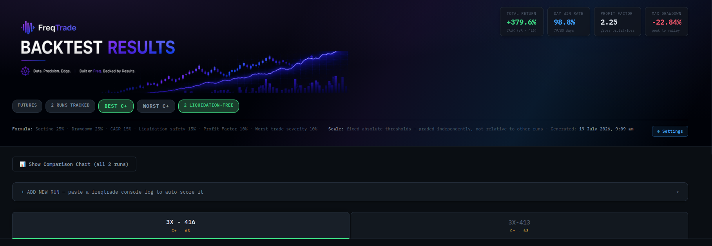
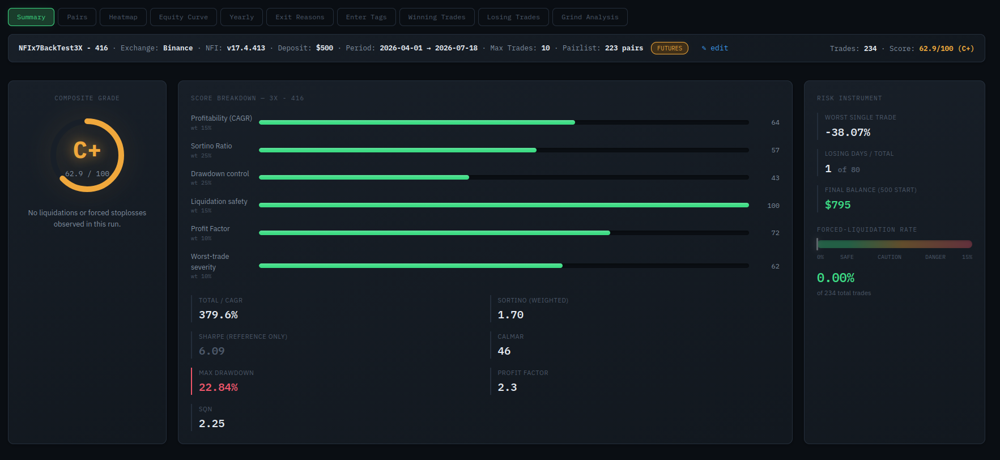

# FreqForge

Self-hosted app for grading FreqForge backtest runs at different leverage levels. Real
SQLite storage, served over HTTP, accessible from any device on your network while
the server's running. Every score is computed **independently per run against fixed
thresholds** — adding, removing, or editing one run never changes another's grade.
Scoring weights and thresholds are configurable via the in-app **⚙ Settings** panel.

A dashboard for analysing Freqtrade strategies, backtests, and trading performance.

## Screenshots

### Dashboard



### Backtest Results



## Project structure

```
FreqForge/
├── app.py                    Flask backend, SQLite storage, scoring config API
├── static/
│   ├── index.html            HTML skeleton only — no embedded CSS/JS
│   ├── css/app.css           All styling
│   ├── img/banner.png        Header banner image (swap freely, keep the filename)
│   └── js/
│       ├── constants.js      Grade colors, letter-grade bands, core state (RUNS/DATA/ORDER)
│       ├── api.js            fetch wrappers: loadRuns, apiSaveRun, apiDeleteRun
│       ├── config.js         Scoring config: defaults, fetch/save against /api/config
│       ├── scoring.js        The actual scoring curves + recompute()
│       ├── hero.js           Top banner: stat cards, badges, dynamic formula/methodology text
│       ├── filters.js        Exchange/Version filter bar
│       ├── parsers.js        Console-log and trades.json parsers
│       ├── addrun.js         "+ Add New Run" panel logic
│       ├── summary.js        Run banner, grade dial, Quick Edit (rename/exchange)
│       ├── settings.js       ⚙ Settings modal for scoring weights/thresholds
│       ├── nav.js            Leverage selection, subtab-preserving navigation
│       ├── tabs.js           Every detail tab: Pairs, Heatmap, Grind Analysis, etc.
│       └── app.js            init(), backup export/import
├── requirements.txt
├── Dockerfile
└── docker-compose.yml
```

Plain `<script src="...">` tags, loaded in dependency order — no build step, no
bundler. Everything shares one global scope, same as the original single-file
version; the split is purely for readability and navigation, not a different
runtime model.

## Run it

### Option A: Docker (matches your existing NFI stack)

```bash
cd FreqForge
docker compose up -d --build
```

Open `http://<your-machine-ip>:5055` from any device on your LAN.

Data lives in `./data/leverage_runs.db` on the host (bind-mounted), so it survives
container rebuilds/recreates same as your other services.

### Option B: Plain Python, no Docker

```bash
cd FreqForge
pip install -r requirements.txt
python app.py
```

Open `http://localhost:5055`.

---

## Adding a run

Click **"+ ADD NEW RUN"** to expand the panel. Two files matter per run — only the
first is required, the second unlocks several extra detail tabs.

### Step 1 — run the backtest

This is the actual command used to produce each leverage run (this example is 5x —
swap the strategy name, `--timerange`, and output filenames for other leverage
levels):

```bash
# 5x
docker compose run --rm freqtrade_backtest_binance backtesting \
  --config user_data/config_back_test.json \
  --strategy NFIx7BackTest5x \
  --timerange 20250912-20260712 --timeframe 5m \
  --export trades --breakdown day \
  --backtest-filename user_data/backtest_results/leverage_test/baseline_5x \
  2>&1 | tee user_data/backtest_results/leverage_test/baseline_5x_console.log
```

This one command produces **two separate files you need**, in two different places:

| File | Where it lands | What it's for |
|---|---|---|
| `baseline_5x_console.log` | Exactly where you told it to (`leverage_test/`) — this is just your terminal's `tee` output | Load as the **console log** |
| `backtest-result-<timestamp>.zip` | `user_data/backtest_results/` (the parent folder, **not** `leverage_test/`) — freqtrade ignores `--backtest-filename` for this one and auto-names it | Extract → gives you the **trades JSON** |

### Step 2 — load the console log (required)

The `.log` file is ready to use as-is — no extraction needed. In the Add New Run
panel, either paste its contents into the text box or use the file picker (it'll
guess the leverage label from the filename, e.g. `baseline_5x_console.log` → `5x`).

### Step 3 — find and extract the trades JSON (optional, unlocks more tabs)

Freqtrade bundles trade-level data into a `.zip`, dropped in the **parent**
`backtest_results/` folder with an auto-generated timestamped name — not the path you
specified. Find it:

```bash
cd user_data/backtest_results
ls *.zip
```

You'll likely see more zips than backtests you've actually run — old attempts, other
leverage levels, crashed runs, etc. all pile up here. To identify which one is your
5x run specifically, peek inside — the strategy filename gives it away:

```bash
unzip -l backtest-result-2026-07-12_20-52-42.zip
# look for something like: backtest-result-2026-07-12_20-52-42_NFIx7BackTest5x.py
# → that timestamp is your 5x run
```

Extract it:

```bash
mkdir -p extracted/5x
unzip -o backtest-result-2026-07-12_20-52-42.zip -d extracted/5x
ls extracted/5x
```

You'll get five files. The one you want has **no suffix** — just the timestamp,
e.g. `backtest-result-2026-07-12_20-52-42.json`. Ignore the other four
(`_config.json`, `_NFIx7BackTest5x.py`, `_market_change.feather`, `_wallet.feather`)
— none of those are the trades data.

### Step 4 — load both files, save

Load that `.json` file into the **"Trades JSON"** file picker, alongside the console
log already loaded in Step 2. Click **Parse log**, fix anything with an amber border
in the review panel, then **Save this run**.

Repeat Steps 1–4 for each leverage level.

Repeat for each leverage level (2x, 3x, 5x, 10x, 15x, or however many you're running).

---

## The tabs

Once a run is saved, click its leverage tile to see:

| Tab | Needs trades.json? | What it shows |
|---|---|---|
| **Summary** | No | Grade dial, score breakdown, risk instrument panel |
| **Pairs** | No | Per-pair performance (from the log's `BACKTESTING REPORT` table) |
| **Heatmap** | No* | Daily profit calendar (from `DAY BREAKDOWN`) |
| **Equity Curve** | No | Cumulative profit chart, built from the same daily data |
| **Yearly** | No | Daily data aggregated by calendar year |
| **Exit Reasons** | No* | Exit-reason breakdown (from `EXIT REASON STATS`) |
| **Enter Tags** | No* | Entry-tag breakdown (from `ENTER TAG STATS`) |
| **Winning Trades** | **Yes** | Every profitable trade, best first |
| **Losing Trades** | **Yes** | Every losing trade, worst first |

**\*** Heatmap, Exit Reasons, and Enter Tags work from the log alone, but freqtrade's
own tables are pair-agnostic (aggregated across all pairs). **If you've also loaded
trades.json**, these three tabs additionally show a **Pairs** column — which specific
pairs contributed to each exit reason, tag, or day. Without trades.json, you still get
the aggregate numbers, just not the per-pair breakdown.

---

## Scoring methodology

Each run is graded **independently** against fixed thresholds — never relative to
other runs in the database. **These are the defaults** — every weight and threshold
below is editable in-app via **⚙ Settings** (top right of the header):

| Category | Default Weight | Default Scale |
|---|---|---|
| Sortino Ratio | 25% | 0→0pts, 1.5→50pts, 3.0+→100pts |
| Drawdown control | 25% | 0%→100pts, 10%→90pts, 20%→50pts, 40%→0pts |
| CAGR | 15% | log-scaled, 100%→50pts, 10000%+→100pts |
| Liquidation-safety | 15% | forced-exit rate; 0%→100pts, 10%+→0pts |
| Profit Factor | 10% | 1.0→20pts, 2.0→70pts, 10.0+→100pts |
| Worst-trade severity | 10% | `100 + worst_trade_%` (a -100% trade scores 0) |

Sortino is used instead of Sharpe (it only penalizes downside deviation, so it
doesn't punish large winning trades). If freqtrade reports the broken `-100.00`
sentinel value for Sortino (meaning no downside deviation was observed), it's scored
as 100 — best-in-class, not worst.

These thresholds are opinionated, not universal — there's no single industry-standard
formula for this. They're synthesized from published quant-deployability guidelines
where those hold up at leveraged-crypto scale, and adapted where they don't (e.g.
Calmar was deliberately excluded — at this leverage scale every run blows past its
"strong" threshold by 1000x+, so it stops being able to tell runs apart).

---

## Configuring the scoring

Click **⚙ Settings** (top of the page) to adjust:

- **Category weights** — must sum to 100; the panel validates this live as you type
  and won't let you save an invalid total.
- **Curve thresholds** — the specific values that shape each scoring curve (e.g.
  "Drawdown 0pts at %" controls how strict the drawdown penalty is).

Changes apply immediately to every run's grade after saving — this is a genuine
recompute, not a display-only change. The formula line in the header and the
Methodology note at the bottom of the page are both generated live from your current
settings, so they can never go stale the way hardcoded copy would.

Settings are stored server-side in `data/scoring_config.json` (same directory as the
SQLite database, same Docker volume — survives rebuilds). Deleting that file resets
everything to defaults on the next request.

## Backup

- **Export backup** (button in the Add Run panel) downloads a `.json` snapshot of
  every run in the database.
- **Import backup** merges one back in.
- Or just copy `data/leverage_runs.db` directly — it's a real SQLite file, works with
  any SQLite tooling, and could be folded into your existing `backup_freqtrade.sh`
  routine.

---

## Notes / known limitations

- **The log parser matches freqtrade's Rich-rendered console tables** (Unicode
  box-drawing characters like `│`, not ASCII pipes). If a future freqtrade version
  changes its table formatting, the parser may need small regex tweaks in
  `static/index.html` (`parseFreqtradeLog` function). The manual-review step means a
  parser miss never blocks you from saving a run — worst case you type the field in
  by hand.
- **The trades.json parser expects freqtrade's standard export schema**
  (`{"strategy": {"<name>": {"trades": [...]}}}`, with `pair`, `profit_ratio`,
  `exit_reason`, `enter_tag`, `open_date`, `close_date` per trade). This has been
  verified against a real export — if a future freqtrade version changes this shape,
  the fix goes in `parseTradesJSON`.
- **The banner image** (`static/img/banner.png`) is a static file, not generated by
  the app — swap it for anything you like, just keep the filename the same, or update
  the `` path in `static/index.html` if you rename it.
- **Empty database ≠ unreachable server.** If you delete every run, the database
  correctly stays empty on reload — it won't silently repopulate with placeholder
  data. Placeholder seeding only happens the very first time the backend truly can't
  be reached at all (e.g., before you've started it once).
